# Architecture

## Overview
The workflow platform is organized as a reusable engine module plus a host application and a separate UI application.

- `workflow-engine` provides DSL parsing, orchestration, handlers, persistence adapters, and configurable REST APIs.
- `host-app-example` owns security/auth context and business integration.
- `ui` is a standalone React app that consumes host APIs.

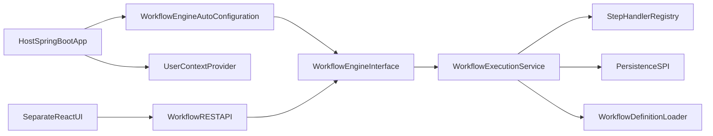

## Module Breakdown

### 1) `workflow-engine`
Core reusable module with:
- Auto-configuration (`workflow.engine.*`)
- Definition loading (`file`, `classpath`; `db` deferred)
- Workflow orchestration (`start`, `resume`, `rollback`, `get`)
- Step handler strategy
- Persistence SPI + JPA adapters
- Workflow/task/event APIs

### 2) `host-app-example`
Integration sample that demonstrates:
- Spring Security ownership
- `UserContextProvider` 11
- Example workflow start/rollback endpoints
- File-based definition loading config

### 3) `ui`
Standalone dashboard:
- Definitions list + details
- DAG visualization
- Running workflow instances
- Task management and approvals
- Runtime timeline

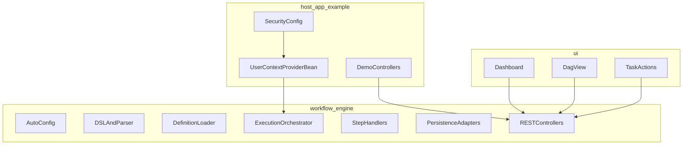

## Configuration Model
The engine behavior is driven by nested properties under `workflow.engine`.

- `enabled`
- `api.enabled`, `api.base-path`
- `ui.enabled`, `ui.path` (metadata; UI is separate)
- `definition.source`, `definition.path`, `definition.cache-enabled`
- `execution.max-retries`, `execution.retry-backoff-ms`
- `persistence.type`
- `security.enabled`

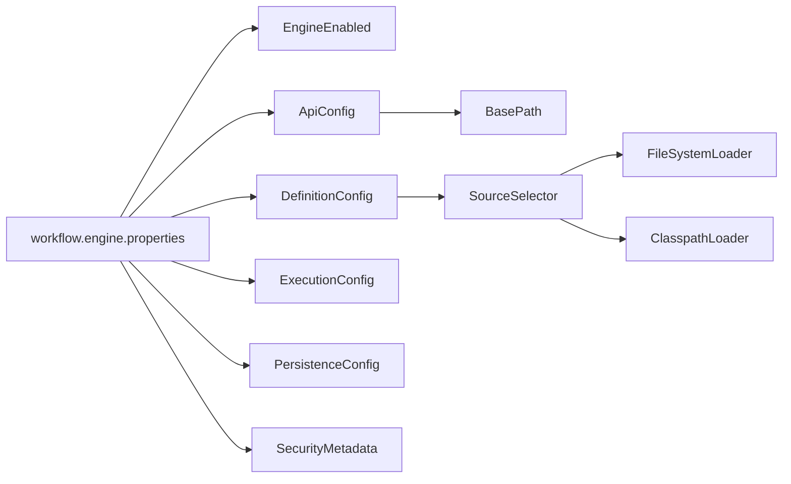

## Definition Loading and Caching
`WorkflowDefinitionLoader` is the source abstraction.

- File loader reads `${path}/${workflowId}.json`
- Classpath loader reads `${path}/${workflowId}.json` from resources
- Caching decorator controls hot-reload behavior:
  - cache enabled: memoized definitions
  - cache disabled: reload each request

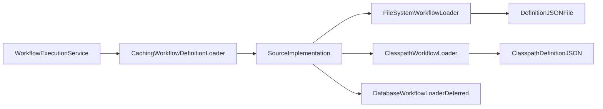

## Orchestration Lifecycle
Engine orchestration follows a deterministic loop over current step pointer + context.

1. Start or resume workflow
2. Resolve current step from definition
3. Dispatch to handler by `StepType`
4. Persist history snapshot and updated context
5. Continue / wait / complete

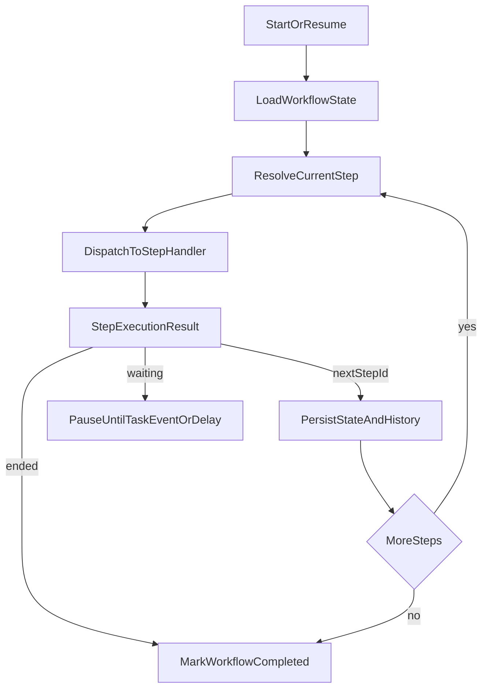

## Step Handler Strategy
Each task type is implemented through `StepHandler`.

- `SYSTEM`: internal action invocation path
- `USER`: create/await user task
- `DECISION`: evaluate branching expressions
- `API`: outbound call with retry/backoff + response mapping
- `EVENT`: wait for correlation-based signal
- `DELAY`: scheduler-based pause
- `SCRIPT`: lightweight expression mutation

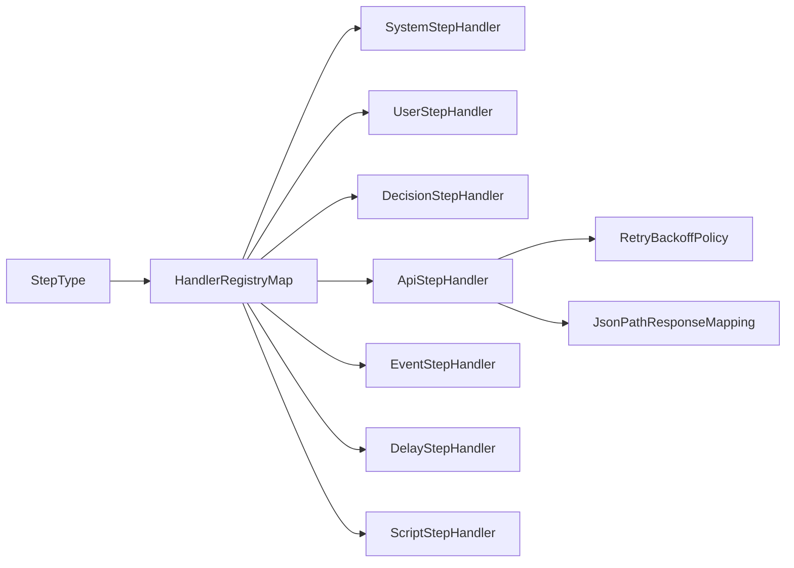

## Persistence Architecture
Persistence is abstracted behind SPI interfaces:
- `WorkflowRepository`
- `HistoryRepository`
- `TaskRepository`

Default adapters are JPA-backed.

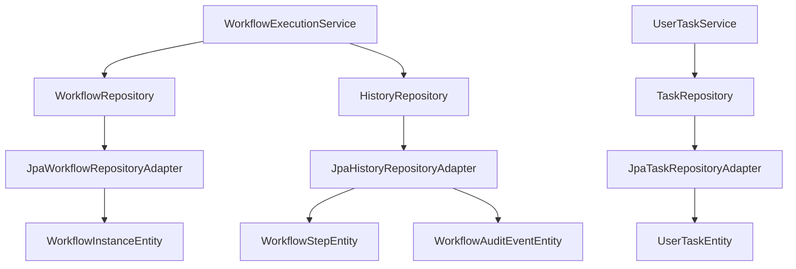

## API Surface
All engine APIs are under configurable base path (`workflow.engine.api.base-path`, default `/workflows`) and can be disabled with `workflow.engine.api.enabled=false`.

- Workflow: start/resume/rollback/get/list
- Task: list/claim/approve/reject/approvals
- Runtime events: publish/list
- Definitions: list/get

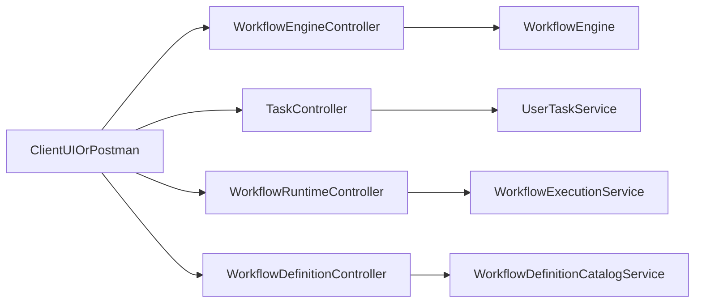

## User Task and Approval Model
User tasks are resolved by host-driven context and assignment strategies.

Visibility and actions are governed by:
- assignment (`USER`, `ROLE`, `GROUP`, `EXPRESSION`)
- candidates
- approval policy (`ANY`, `ALL`, `MIN_APPROVAL`)

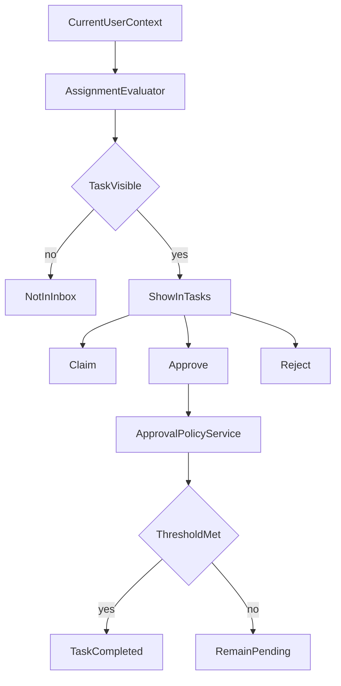

## Rollback and Compensation
Rollback is intentionally state-oriented, not side-effect reversal.

- marks recent history as `ROLLED_BACK`
- resets workflow pointer to prior step
- restores persisted context path
- recreates user interaction path through normal execution
- compensation hook is optional and host-defined

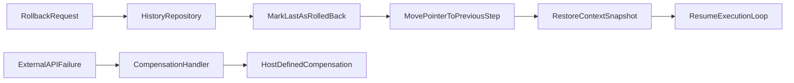

## Event and Delay Waiting Semantics
Current sample implementation keeps waiting registry in-memory.

- `EVENT` pauses until matching `eventName + correlationId`
- `DELAY` schedules resume via task scheduler

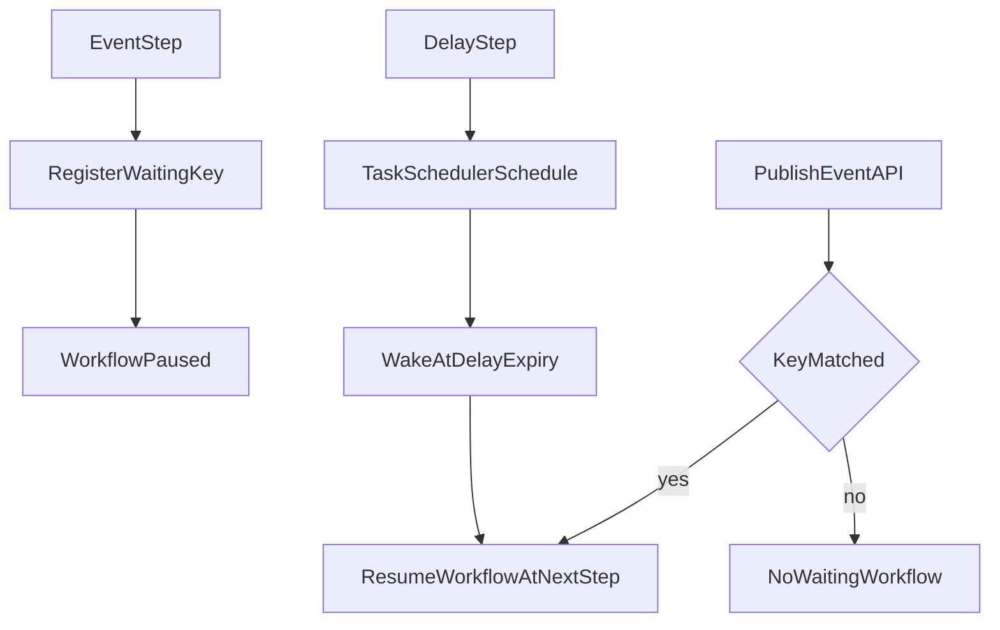

## Security Boundaries
Security is host-owned.

- Engine does not implement authn/authz.
- Host app secures endpoints (sample uses HTTP Basic).
- Engine consumes user identity/roles via `UserContextProvider`.

## Extensibility Summary
Override points designed for host customization:
- `UserContextProvider`
- `WorkflowDefinitionLoader`
- `StepHandler`
- `AssignmentResolver`
- `WorkflowRepository` / `HistoryRepository` / `TaskRepository`
- `CompensationHandler`
- `StepExecutionListener`
- `NotificationPublisher`

## Operational Notes
- Use shared/external coordination for event waiting and delayed scheduling in multi-node production.
- Keep workflow definitions versioned and immutable where possible.
- Add host-side observability dashboards using Micrometer counters and audit streams.
